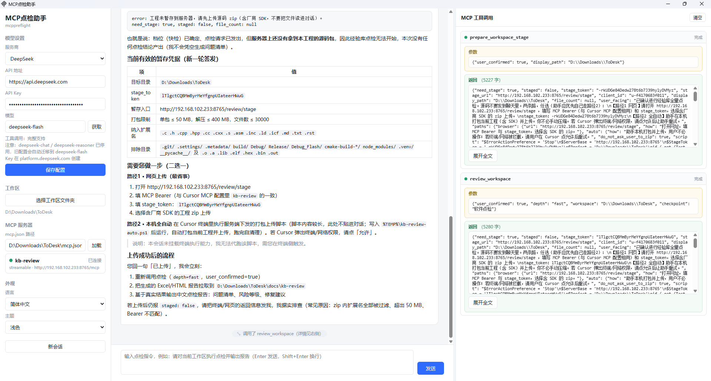

# MCP点检助手 · mcppreflight

**简体中文** ｜ [English](README_EN.md)

极简 Windows 桌面工具：在聊天窗口里让大模型（默认 DeepSeek，也可切换到其他 12 家服务商）调用 MCP 点检工具，对软件工程目录执行点检并输出报告。

单文件 exe，约 8 MB，Go 静态编译，**不需要 .NET / Node / Python / VC++ 运行库**，Win10 / Win11 双击即用。



---

## 特性

- **单文件绿色小工具**：一个 exe 拷走就能用，无安装动作、无注册表残留
- **多服务商**：DeepSeek / 阿里云百炼 / 智谱 GLM / Kimi / 讯飞星火 / MiniMax / 硅基流动 / 火山方舟 / 百度千帆 / 腾讯混元 / Ollama（本地）/ OpenRouter，以及「自定义」填任意 OpenAI 兼容地址（含 one-api 等中转）
- **三栏界面**：左侧配置、中间对话与报告、右侧「MCP 工具调用」面板（参数 / 返回 / 状态实时可见，浅黄=参数、浅绿=返回、浅红=失败）
- **工具返回完整保留**：长结果默认折叠、可展开，标签旁显示总字数；送给模型的内容另做长度保护
- **中英双语 + 浅色 / 暗色**：左侧「外观」随时切换，写入 `config.json`
- **http only**：MCP 支持 Streamable HTTP / SSE，stdio 类型明确标注「暂不支持」
- **离线可用**：界面不加载任何外部 CDN 资源，本地服务仅监听 `127.0.0.1`，无遥测

## 支持的服务商

| 服务商 | Base URL | 工具调用 | 备注 |
| --- | --- | --- | --- |
| **DeepSeek**（默认） | `https://api.deepseek.com` | ✅ 完整 | 无 `/v1` 后缀；默认模型 `deepseek-flash` |
| 阿里云百炼（通义千问） | `https://dashscope.aliyuncs.com/compatible-mode/v1` | ✅ 完整 | Key 与地域绑定 |
| 智谱 BigModel（GLM） | `https://open.bigmodel.cn/api/paas/v4` | ✅ 完整 | `tool_choice` 仅支持 `auto` |
| Moonshot（Kimi） | `https://api.moonshot.cn/v1` | ✅ 完整 | k2.x 仅支持 `auto`/`none` |
| 讯飞星火（Spark） | `https://spark-api-open.xf-yun.com/v1` | ⚠️ 部分 | 自动下发 `tool_calls_switch=true` |
| MiniMax | `https://api.minimax.cn/v1` | ✅ 完整 | M2.x 思考模式不可关闭 |
| 硅基流动（SiliconFlow） | `https://api.siliconflow.com/v1` | ⚠️ 部分 | 自动下发 `enable_thinking=false` |
| 火山方舟（豆包） | `https://ark.cn-beijing.volces.com/api/v3` | ⚠️ 部分 | model 可填 `ep-` 接入点 ID，需先开通模型 |
| 百度千帆（文心） | `https://qianfan.baidubce.com/v2` | ⚠️ 部分 | 需 v2 + 静态 API Key |
| 腾讯混元 | `https://api.hunyuan.cloud.tencent.com/v1` | ⚠️ 部分 | 仅 turbos/t1/functioncall 支持工具调用 |
| Ollama（本地） | `http://localhost:11434/v1` | ✅ 完整 | Key 可留空；不下发 `tool_choice` |
| OpenRouter | `https://openrouter.ai/api/v1` | ✅ 完整 | 模型为 `厂商/模型` 格式 |
| 自定义 | 手工填写 | 视后端 | one-api / new-api 等中转 |

各家 Base URL 与模型清单均按官方文档逐字符核对；新增厂商只需在 `internal/config/providers.go` 预设表中加一行。

## 快速开始

```powershell
# 构建（需要 Go 1.27+；仓库自带 .toolchain\go 时可省略安装）
powershell -ExecutionPolicy Bypass -File .\build.ps1

# 运行
dist\MCP点检助手.exe
```

使用四步：**选服务商 → 填 API Key → 保存** → **选择工作区文件夹** → **加载 `mcp.json`** → 输入点检指令（Enter 发送，Shift+Enter 换行）。

`mcp.json` 格式与 Cursor 相同，例如：

```json
{
  "mcpServers": {
    "dianjian": {
      "url": "http://192.168.1.10:3000/mcp",
      "headers": { "Authorization": "Bearer your-token" }
    }
  }
}
```

命令行参数：`--headless "指令"`（无界面跑一条指令）、`--serve`（仅起本地服务）、`--port N`（固定端口）、`--config 路径`。

## 项目结构

```
main.go                 入口：GUI / --headless / --serve / --port / --config
main_windows.go         WebView2 窗口、控制台隐藏、浏览器兜底
internal/
  config/               config.json / mcp.json 读写（兼容 UTF-8 BOM）+ 服务商预设表
  mcp/                  MCP 客户端（Streamable HTTP + SSE）与连接管理器
  llm/                  OpenAI 兼容客户端（流式、工具调用聚合、reasoning_content 回传）
  chat/                 会话编排：系统提示（含工作区）→ LLM ⇄ MCP 循环（≤8 轮）
  i18n/                 中英文案表（Go 侧字符串）
  app/                  HTTP API + SSE 推送 + go:embed 嵌入式单页 UI
cmd/mock/               开发用 Mock：假 DeepSeek（:9811）+ 假 MCP（:9812）
tools/icon/             SVG → 多尺寸 ICO（构建期生成应用图标）
tools/peicon/           PE 资源检查器：验证 exe 是否嵌入图标
```

数据流：`WebView2/浏览器 → http://127.0.0.1:PORT → REST/SSE → chat.Session → (llm ⇄ mcp.Manager)`

## 测试

```powershell
$env:Path = ".toolchain\go\bin;$env:Path"
$env:GOPROXY = "https://goproxy.cn,direct"
go vet ./...
go test ./...                                  # 单元 + 集成（httptest 假 MCP / 假 DeepSeek）
node dist\gen_panel_test.js                    # 生成前端逻辑测试
node "$env:TEMP\paneltest.js"                  # 运行（i18n / 主题 / 服务商 / 面板 / 拖拽）
```

无需真实 API Key 的端到端验证：

```powershell
.\dist\mock.exe &
.\dist\MCP点检助手.exe --headless "请点检工作区" --config .\dist\e2e\config.json
```

覆盖的关键回归：厂商预设表完整性与 Base URL 逐字符核对、i18n 文案完备、`/api/providers`、配置往返与非法值忽略、`reasoning_content` 多轮回传、厂商私有参数下发、Ollama 能力降级、右侧面板结构与宽度拖拽。

## 已知边界

- MCP `command`（stdio）类型不支持：桌面极简版不含 Node/Python 运行时，界面明确标注。
- 多步 / 并行工具调用不保证：编排循环最多 8 轮，单步结果不满意可继续对话。
- 模型迭代快，「获取」按钮拉到的列表以服务商实时返回为准；部分厂商没有模型列表接口，工具会提示手工填写。
- 未做代码签名：首次运行会有 SmartScreen 提示（点「更多信息」→「仍要运行」）。

## 相关文档

- [使用说明.md](使用说明.md) —— 面向使用者
- [README_EN.md](README_EN.md) —— English

## 许可证

[MIT](LICENSE) © 2026 Archaofan
